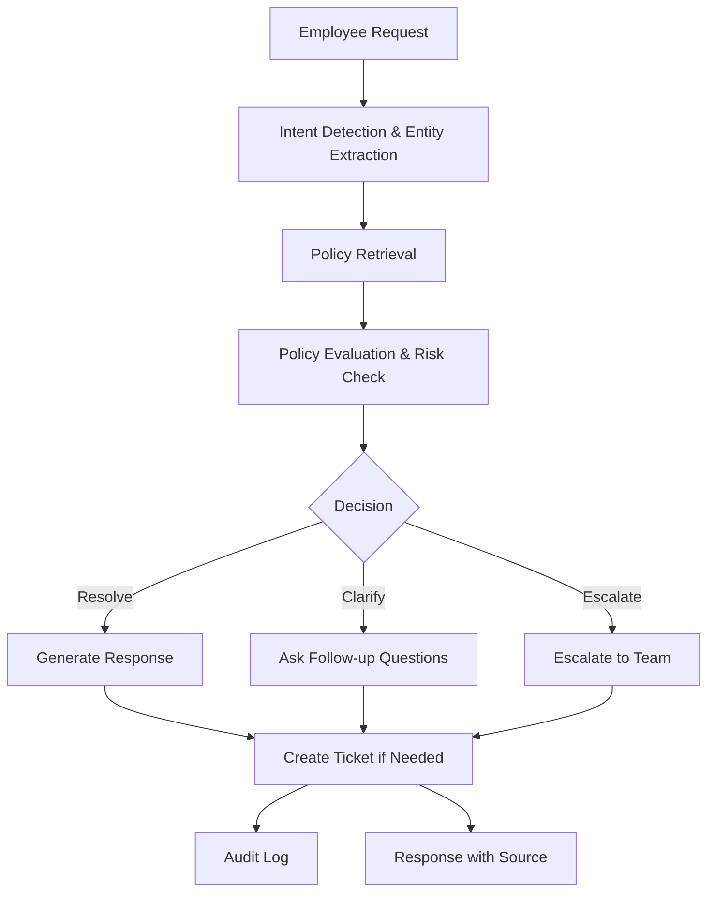

# Veridian IT Support Agent

## Assignment: AIONOS Agentic AI Factory — Assignment 2

Build an internal employee-support agent for the IT function at Veridian Corp.

## Problem Statement

Employee IT support is often repetitive and requires interpreting policies contextually. Requests vary in clarity, and risky requests need human escalation. The goal is to build an AI agent that:

1. Understands the employee's issue
2. Finds the relevant policy/resolution
3. Asks sensible follow-up questions
4. Resolves simple requests
5. Escalates risky or unclear requests
6. Creates a structured ticket
7. Shows the source used for its answer
8. Maintains an audit trail

## Solution Overview

We built a policy-grounded AI agent that combines large language models (LLMs) for natural language understanding with deterministic rules for policy enforcement and risk assessment. The agent retrieves relevant policies from a knowledge base, evaluates requests against those policies, and provides traceable, explainable responses.

## Features

- **Policy Grounding**: Every response cites the specific policy source (KB-XX)
- **Intent Classification**: Identifies employee intent from natural language
- **Entity Extraction**: Extracts relevant details like years of service, contractor status, etc.
- **Risk Assessment**: Classifies requests as LOW, MEDIUM, or HIGH risk
- **Policy Enforcement**: Uses deterministic rules to ensure compliance
- **Interactive Clarification**: Asks follow-up questions when information is missing
- **Escalation Routes**: Sends risky requests to appropriate teams (Security, IT, Finance)
- **Ticket Generation**: Creates structured tickets for actions requiring tracking
- **Audit Trail**: Logs every interaction for compliance and review
- **Demo Scenarios**: Pre-built examples to showcase capabilities
- **Enterprise UI**: Professional Streamlit dashboard with sidebar navigation

## Agent Workflow



## System Architecture

```mermaid
graph TD
    A[Streamlit UI] --> B[Agent Router]
    B --> C[LLM Handler]
    B --> D[Policy Engine]
    B --> E[Risk Engine]
    B --> F[Ticket Generator]
    B --> G[Audit Logger]
    D --> H[Policy Retriever]
    H --> I[Knowledge Base (JSON)]
```

## Tech Stack

- **Frontend**: Streamlit
- **Backend**: Python
- **Language Model**: Optional OpenAI GPT-3.5-Turbo (with deterministic fallback)
- **Data Storage**: JSON files (policies, employee requests, tickets, audit log)
- **Retrieval**: Keyword-based policy retrieval
- **Testing**: Built-in test modules

## Folder Structure

```
veridian-it-agent/
├── app.py                 # Main Streamlit application
├── requirements.txt       # Python dependencies
├── README.md              # This file
├── .env.example           # Example environment variables
├── data/                  # JSON data files
│   ├── policies.json
│   ├── employee_requests.json
│   └── tickets.json
├── agent/                 # Agent logic modules
│   ├── __init__.py
│   ├── llm_handler.py     # LLM integration with fallback
│   ├── policy_engine.py   # Intent detection, policy evaluation, risk assessment
│   ├── retrieval.py       # Policy retrieval
│   ├── ticketing.py       # Ticket generation
│   └── audit.py           # Audit logging
├── tests/                 # Unit tests
│   ├── test_policy_engine.py
│   ├── test_routing.py
│   ├── test_security.py
│   └── test_requests.py
├── docs/                  # Documentation
│   ├── architecture.md
│   ├── process_flow.md
│   ├── assumptions.md
│   ├── interview_defence.md
│   └── demo_script.md
└── screenshots/           # UI screenshots
```

## Setup Instructions

1. Clone the repository
2. Install dependencies:
   ```bash
   pip install -r requirements.txt
   ```
3. (Optional) Set up OpenAI API key for LLM features:
   ```bash
   export OPENAI_API_KEY="your-api-key-here"
   ```
   Or create a `.env` file with:
   ```
   OPENAI_API_KEY=your-api-key-here
   ```
4. Run the application:
   ```bash
   streamlit run app.py
   ```

## Environment Variables

- `OPENAI_API_KEY`: OpenAI API key for LLM-enhanced features (optional)
  - If not set, the agent uses deterministic fallback and still functions fully

## How to Run

```bash
# Install dependencies
pip install -r requirements.txt

# Run the app
streamlit run app.py
```

## How to Test

Run the unit tests:
```bash
python -m pytest tests/ -v
```

## Demo Scenarios

The application includes a demo section with predefined examples:

1. **Guest Wi-Fi Request**: "Can I get Wi-Fi for a guest tomorrow?"
   - Expected: Informational response, no ticket, source KB-07

2. **Security Incident**: "I got an email asking for my password."
   - Expected: HIGH risk, security escalation, source KB-09

3. **Approval Workflow**: "I work from home four days a week and need a monitor."
   - Expected: Medium risk, escalation for approvals, source KB-10 + Asset Management Policy

4. **Ambiguous Request**: "hey can you help, its not working"
   - Expected: Clarification question, no hallucination

5. **Hardware Decision**: "My laptop is dead and I've had it for 3.5 years."
   - Expected: Medium risk, escalation for approvals, sources KB-03 + Asset Management Policy

6. **Contractor VPN**: "My contractor needs VPN access."
   - Expected: Medium risk, requires manager approval, source KB-02

## Data Governance

Strict adherence to supplied data only:
- No invented policies, approval rules, SLAs, or procedures
- No hallucination: if information is insufficient, ask for clarification or escalate
- All responses grounded in the provided knowledge base (KB-01 to KB-10 and Asset Management Policy)
- Employee requests and ticket queue used only as provided

## AI Usage Disclosure

- **LLM**: Used for natural language understanding (intent classification, entity extraction) and response generation when OpenAI API key is available
- **Fallback**: Deterministic rule-based intent classification and template-based responses when LLM is unavailable
- **Retrieval**: Keyword-based policy retrieval (not AI-based embedding)
- **Reasoning**: Deterministic Python rules for policy enforcement, risk assessment, and decision making
- **Responses**: All AI-generated responses are grounded against retrieved policy and never invent company policy

## Known Limitations

- Retrieval is based on keyword matching rather than semantic search
- LLM integration is optional and requires OpenAI API key
- Ticket IDs are generated sequentially and may reset on restart (in production, use a database)
- Audit log is stored in JSON file (not suitable for high-volume production)
- UI is built with Streamlit for simplicity; enterprise applications might use other frameworks

## Assumptions

- Employees are full-time unless specified as contractor
- Date format in requests is not used in logic
- The agent does not integrate with actual ticketing or identity systems
- Policy retrieval confidence is not used to block processing (fallback to lowest confidence policy)

## Future Improvements

- Integrate with enterprise ticketing system (Jira, ServiceNow)
- Add single sign-on (SSO) and role-based access control (RBAC)
- Implement semantic search for policy retrieval using embeddings
- Add real-time monitoring and analytics
- Implement human-in-the-loop workflows for approvals
- Connect to live knowledge base sources
- Add multi-language support
- Enhance UI with advanced components (charts, workflow visualizers)

## License

This project is built for the AIONOS Assignment 2.